# Architettura database (ER)

Di seguito un diagramma ER in Mermaid derivato da `core/models.py`.
{ .center }

```mermaid
erDiagram
    USER {
        string email PK
        string role
        boolean is_staff
        datetime date_joined
    }

    LANGUAGE {
        string id PK
        string name_full
        int position
        string family
        string top_level_family
    }

    PARAMETERDEF {
        string id PK
        string name
        int position
        boolean is_active
    }

    QUESTION {
        string id PK
        string parameter_id FK
        text text
        boolean is_stop_question
    }

    ANSWER {
        int id PK
        string language_id FK
        string question_id FK
        string status
        string response_text
        boolean modifiable
    }

    EXAMPLE {
        int id PK
        int answer_id FK
        string number
    }

    MOTIVATION {
        int id PK
        string code
        string label
    }

    QUESTION_ALLOWED_MOTIVATION {
        int id PK
        string question_id FK
        int motivation_id FK
        int position
    }

    ANSWER_MOTIVATION {
        int id PK
        int answer_id FK
        int motivation_id FK
    }

    LANGUAGE_PARAMETER {
        int id PK
        string language_id FK
        string parameter_id FK
        string value_orig
        boolean warning_orig
    }

    LANGUAGE_PARAMETER_EVAL {
        int id PK
        int language_parameter_id FK
        string value_eval
        boolean warning_eval
    }

    PARAMETER_CHANGE_LOG {
        int id PK
        string parameter_id FK
        int changed_by_id FK
        datetime changed_at
    }

    LANGUAGE_REVIEW {
        int id PK
        string language_id FK
        int created_by_id FK
        string decision
        datetime created_at
    }

    PARAMETER_REVIEW_FLAG {
        int id PK
        string language_id FK
        string parameter_id FK
        int user_id FK
        boolean flag
    }

    SUBMISSION {
        int id PK
        string language_id FK
        int submitted_by_id FK
        datetime submitted_at
    }

    SUBMISSION_ANSWER {
        int id PK
        int submission_id FK
        string question_code
        string response_text
    }

    SUBMISSION_ANSWER_MOTIVATION {
        int id PK
        int submission_id FK
        string question_code
        string motivation_code
    }

    SUBMISSION_EXAMPLE {
        int id PK
        int submission_id FK
        string question_code
    }

    SUBMISSION_PARAM {
        int id PK
        int submission_id FK
        string parameter_id
        string value_orig
        string value_eval
    }

    GLOSSARY {
        int id PK
        string word
    }

    PARAM_SCHEMA {
        int id PK
        string label
    }

    PARAM_TYPE {
        int id PK
        string label
    }

    PARAM_LEVEL_OF_COMPARISON {
        int id PK
        string label
    }

    SITE_CONTENT {
        int id PK
        string key
        string page
        int updated_by_id FK
    }

    USER }o--o{ LANGUAGE : "N:N m2m_languages"
    USER ||--o{ LANGUAGE : "1:N assigned_user"

    PARAMETERDEF ||--o{ QUESTION : "1:N questions"
    LANGUAGE ||--o{ ANSWER : "1:N answers"
    QUESTION ||--o{ ANSWER : "1:N answers"
    ANSWER ||--o{ EXAMPLE : "1:N examples"

    QUESTION ||--o{ QUESTION_ALLOWED_MOTIVATION : "1:N allowed_motivation_links"
    MOTIVATION ||--o{ QUESTION_ALLOWED_MOTIVATION : "1:N allowed_for_questions"

    ANSWER ||--o{ ANSWER_MOTIVATION : "1:N answer_motivations"
    MOTIVATION ||--o{ ANSWER_MOTIVATION : "1:N answer_motivations"

    LANGUAGE ||--o{ LANGUAGE_PARAMETER : "1:N language_parameters"
    PARAMETERDEF ||--o{ LANGUAGE_PARAMETER : "1:N language_parameters"
    LANGUAGE_PARAMETER ||--|| LANGUAGE_PARAMETER_EVAL : "1:1 eval"

    PARAMETERDEF ||--o{ PARAMETER_CHANGE_LOG : "1:N change_logs"
    USER ||--o{ PARAMETER_CHANGE_LOG : "1:N changed_by"

    LANGUAGE ||--o{ LANGUAGE_REVIEW : "1:N reviews"
    USER ||--o{ LANGUAGE_REVIEW : "1:N created_by"

    LANGUAGE ||--o{ PARAMETER_REVIEW_FLAG : "1:N review_flags"
    PARAMETERDEF ||--o{ PARAMETER_REVIEW_FLAG : "1:N review_flags"
    USER ||--o{ PARAMETER_REVIEW_FLAG : "1:N review_flags"

    LANGUAGE ||--o{ SUBMISSION : "1:N submissions"
    USER ||--o{ SUBMISSION : "1:N submissions"
    SUBMISSION ||--o{ SUBMISSION_ANSWER : "1:N answers"
    SUBMISSION ||--o{ SUBMISSION_ANSWER_MOTIVATION : "1:N answer_motivations"
    SUBMISSION ||--o{ SUBMISSION_EXAMPLE : "1:N examples"
    SUBMISSION ||--o{ SUBMISSION_PARAM : "1:N params"

    USER ||--o{ SITE_CONTENT : "1:N updated_site_contents"
```

Note:
- `ParamSchema`, `ParamType` e `ParamLevelOfComparison` sono lookup non collegati con FK dirette in `ParameterDef` (attualmente campi testuali).
- Alcune tabelle (`SubmissionAnswer`, `SubmissionAnswerMotivation`, `SubmissionParam`) usano vincoli unici composti ma non una PK esplicita nel modello.
